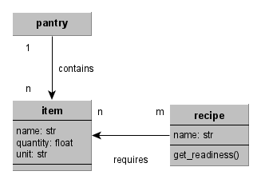

# Context specification

This document contains the context specification of the **tiny-chef** system. It defines the [scope](#scope) and the [objectives](#objectives-and-goals) of the system to clarify its aim.

## Scope

The scope of the **tiny-chef** system is to provide a web-based helper system that assists a user in managing their pantry and diet. The system is designed to be *self-hosted*

## Objectives and Goals

The **tiny-chef** system has the following goals (formulated using the Connextra template "As a \<role> I want to \<goal> in order to \<benefit>."):

* **G1**: As a \<user> I want to \<manage a virtual pantry> in order to \<maintain a digital overview of my pantry>.
* **G2**: As a \<user> I want to \<obtain receipe proposals depending on my pantry> in order to \<optimally use the remaining items of my pantry>.
  * **G2.1**: As a \<user> I want to \<obtain receipe proposals which also depend on my diet preference> in order to \<adhere to dietary restrictions>-
  * **G2.2**: As a \<user> I want to \<obtain a shopping list of all ingredients missing to realize a receipe> in order to \<effectively complete my pantry to implement the receipes>.

The following dietary restrictions (for **G2.1**) will be supported by the **tiny-chef** system: vegan, vegetarian, and none.

## Domain Model

The following model puts the domain objects into relation. It explains, what type of objects are relevant to the **tiny-chef** system.

The `get_readiness()` operation represents that for every receipe a *readiness* value can be calculated, which represents to what degree (0-100%) a list of items covers the required ingredients of that receipe. A readiness of 100% means that all required ingredients are already available, 0% means none of them are. Readiness can be used as a metric to compare two receipes in terms of "how easy it would be to realize them given the current pantry items."